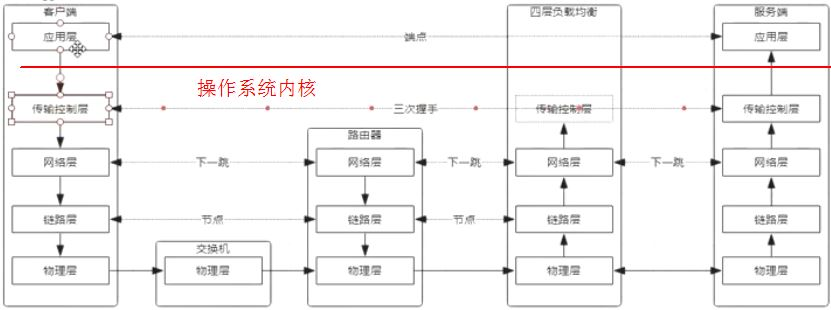

[TOC]

# 高并发负载均衡

解决方案：
- 四层技术
- 七层技术

## 网络协议原理

### OSI参考模型

- **应用层**：（Application）。与人交互，或运行在服务器对外提供服务的tomcat等。对应HTTP、SSH、FTP、SMTP、DNS、Telnet等协议。
- **表示层**：（Presentation）。数据格式化，加密等。无协议。
- **会话层**：（Session）。解除或建立与其他节点的联系。无协议。
- **传输控制层**：（Transport）。提供端对端的接口。对应TCP、UDP协议。
- **网络层**：（NetWork）。为数据包选择路由。对应IP协议。
- **数据链路层**：（Data-Link）。点与点之间的通信，传输有地址的帧，错误检测功能。PPP协议等。
- **物理层**：（Physical）。光纤、wifi、4G网。对应IEEE802等协议。

速记：Please Do Not Tell Stupid People Anything.

### TCP/IP四层网络协议



总结：**TCP/IP协议是基于下一跳机制；IP是端点间（首尾两端）；mac地址是节点间（中间节点）**。

#### 应用层

任务是按传输要求格式字符串，这个传输要求指的就是各种协议。比如HTTP协议，传输的数据必须包括请求方法、HTTP版本、服务器地址、各种请求头等等，同时必须按照指定的排列方式格式化成字符串。响应也需要遵守一定的规则，包括状态码等等。

>对于用户来说，实现网络请求，只需两步：
1、建立连接（传输控制层建立连接），其实会调用底层来实现连接真正的传输和建立，但都属于操作系统内核的步骤，对用户不可见；
2、传送数据（使用http协议发出请求）。

```shell
cd /prod/$$/fd    # $$：当前解释程序的id号，fd：文件描述符
exec 8<> /dev/www.baidu.com/80    # 0输入 1输出 2报错，8自定义文件描述符，<>：输入输出都指向/de*，与百度创建出一个socket（握手）
echo -e 'GET /HTTP/1.0\n' >& 8    # 根据http协议传输数据到百度，&：表示8不是文件而是文件描述符
cat <& 8  # 读出百度的response
```
#### 传输控制层

建立握手（new socket），其实是准备进行握手的包，这个包要经过低层传输出去。这一步骤与具体的应用无关，属于操作系统内核的协议。主要是TCP和UDP协议：TCP面向连接（指请求方new socket的时候，需要等待响应方确认，三次握手，四次分手）。
> 查看服务器完整的连接情况：`netstat -natp`

#### 网络层

互联网中两台计算机的通信寻址采用的是下一跳机制。

查看一台服务器的基本网络配置：

> [root@10-13-47-103 ~]# `cat /etc/sysconfig/network-scripts/ifcfg-eth0`
IPADDR=10.13.174.252
NETMASK=255.255.0.0 # 与IPADDR按位与，获得网络号
GATEWAY=10.13.0.1 # 网关，是路由下一跳地址，路由判定的依据。
DNS1=10.13.255.1

- 如果网关地址是`0.0.0.0`表示目标计算机与当前计算机在同一局域网中。
- 子网掩码为0.0.0.0对应的网关是默认网关】
- 局域网里的默认网关都是以\*.0.1或\*.1.1结尾的路由器地址。
- 网关可以有多个，但默认网关只能有一个。

可以通过`route -n`查看路由表：
> [root@10-13-47-103 ~]# `route -n`
Kernel IP routing table
Destination     Gateway         Genmask         Flags Metric Ref    Use Iface
0.0.0.0             10.13.0.1         0.0.0.0              UG     0          0        0    eth0
10.13.0.0         0.0.0.0             255.255.0.0     U        0          0        0    eth0

#### 链路层

根据下一跳机制，一个数据包要传到某主机，除了要目标IP，还需要下一跳IP。又因为一个数据包只能存一个ip（目标地址），因此需要在链路层给数据包包装一层网卡地址（MAC）。

`arp`协议用来解析ip地址与mac地址的映射关系：

> [root@10-13-47-103 ~]# `arp -a`
gateway (10.13.0.1) at fa:ff:ff:ff:ff:ff [ether] on eth0
? (10.13.255.1) at 52:54:00:19:44:61 [ether] on eth0
? (10.13.255.2) at 52:54:00:86:c6:51 [ether] on eth0
? (10.13.255.3) at 52:63:01:13:fe:03 [ether] on eth0
? (10.13.255.7) at 52:63:01:13:fe:07 [ether] on eth0
? (10.13.255.4) at 52:63:01:13:fe:04 [ether] on eth0

#### 物理层
解析二进制编码，真正进行数据传输。
> **交换机**工作在物理层。**路由器**包含网络层+链路层+物理层。

## 负载均衡服务器

特点：速度特别快、数据包级别转发、不和客户端进行握手。
故包含物理层、链路层、网络层的完整功能，而传输控制层只需要能实现部分功能。不需要进行应用层面的数据包解析，包括数据、协议等。数据包直到后端服务器才开始解析，故称为四层负载均衡，且后端服务器必须是镜像的。

而ng是七层负载均衡，至少要与客户端有一次握手，存在并发上限，ng官方的并发数是5w。同时，后端服务器可以根据功能的不同部署不同的服务。


